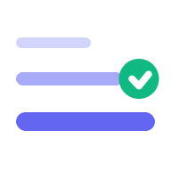

<a id="readme-top"></a>

<!-- PROJECT SHIELDS -->
<p align="center">
  <a href="#getting-started">Getting Started</a>
  &nbsp;&bull;&nbsp;
  <a href="#features">Features</a>
  &nbsp;&bull;&nbsp;
  <a href="#architecture">Architecture</a>
  &nbsp;&bull;&nbsp;
  <a href="#api">API</a>
  &nbsp;&bull;&nbsp;
  <a href="#deployment">Deployment</a>
</p>

<!-- PROJECT LOGO -->
<br />
<div align="center">
  

  <h1 align="center">FreeShelf</h1>

  <p align="center">
    A modern deal tracker for free and heavily discounted PC games.
    <br />
    Discover games worth claiming before the offer expires.
    <br /><br />
    <a href="#getting-started"><strong>Get Started »</strong></a>
  </p>
</div>

---

## About The Project

**FreeShelf** is a Next.js web application that aggregates free PC games and high-value game deals from multiple digital storefronts into one clean, searchable interface.

Instead of checking several storefronts every day, users can use FreeShelf to see:

- Games that are currently free.
- Free games that are about to expire.
- Significant discounts and sale opportunities.
- Current prices across supported stores.
- Historical-low and near-historical-low pricing.
- Game details, ratings, genres, platforms, and claim links.
- Search results with store-by-store pricing.

The application periodically refreshes its data and normalizes results from different sources into a single internal deal model.

### Built With

- [Next.js](https://nextjs.org/) 16
- [React](https://react.dev/) 19
- [TypeScript](https://www.typescriptlang.org/)
- [Tailwind CSS](https://tailwindcss.com/)
- [Upstash Redis](https://upstash.com/) for production caching
- [CheapShark API](https://www.cheapshark.com/) for store/deal data
- Epic Games public promotions data for Epic's current free games
- [Vercel](https://vercel.com/) for deployment and scheduled refreshes
- `next-themes` for light/dark theme support
- `lucide-react` for icons

<p align="right">(<a href="#readme-top">back to top</a>)</p>

---

## Features

### 🎁 Free Games

Aggregates currently free games from supported sources and presents them in a unified feed.

### ⚡ Flash Deals

Highlights free games that are close to expiring. FreeShelf currently treats offers with **24 hours or less remaining** as flash opportunities.

### 🔥 Major Sales

Surfaces significant discounts, with the current refresh pipeline focusing on games discounted by **70% or more**.

### 🔎 Game Search

Search for games and inspect pricing across supported storefronts.

### 💰 Price Comparison

Game detail pages can show:

- Current store prices
- Regular/retail prices
- Discount percentages
- Historical lowest price
- Best current price
- Cheapest store
- Whether a game is currently free
- Whether the current price is close to its historical low

### 🎮 Store Awareness

The application normalizes storefronts into a common platform model, including stores such as:

- Epic Games
- Steam
- GOG
- Humble
- Fanatical
- Green Man Gaming
- GamesPlanet
- DLGamer
- GamesLoad
- and other CheapShark-supported stores

### 🌓 Theme Support

The UI supports light and dark themes through `next-themes`.

### 📱 Responsive UI

The application is structured around reusable React components for deal cards, filters, tabs, navigation, game details, loading states, and other responsive interface elements.

### 🚀 Production-Friendly Data Layer

FreeShelf uses a KV caching layer with:

1. Upstash Redis when production credentials are available.
2. An in-memory fallback for local development.

This means local development can run without setting up Redis first.

<p align="right">(<a href="#readme-top">back to top</a>)</p>

---

## Architecture

At a high level, FreeShelf follows this flow:

```text
                    ┌──────────────────────┐
                    │   External Sources   │
                    │                      │
                    │ Epic Games            │
                    │ CheapShark            │
                    └──────────┬───────────┘
                               │
                               ▼
                    ┌──────────────────────┐
                    │      Fetchers        │
                    │                      │
                    │ epic.ts              │
                    │ cheapshark.ts        │
                    │ search.ts            │
                    └──────────┬───────────┘
                               │
                               ▼
                    ┌──────────────────────┐
                    │ Normalize + Dedup    │
                    │                      │
                    │ Shared Deal model    │
                    └──────────┬───────────┘
                               │
                               ▼
                    ┌──────────────────────┐
                    │     KV Cache         │
                    │                      │
                    │ Upstash Redis        │
                    │ / memory fallback    │
                    └──────────┬───────────┘
                               │
                               ▼
                    ┌──────────────────────┐
                    │    Next.js App       │
                    │                      │
                    │ Home                 │
                    │ Search               │
                    │ Game Details         │
                    └──────────────────────┘
```

### Project Structure

```text
freeshelf-v2/
├── app/
│   ├── api/
│   │   ├── cron/refresh/       # Scheduled deal refresh
│   │   ├── deals/              # Deal API
│   │   ├── debug/              # Debug endpoint
│   │   ├── og/                 # Dynamic Open Graph image
│   │   └── search/             # Search API
│   ├── game/[id]/              # Game detail pages
│   ├── search/                 # Search page
│   ├── _components/            # Page-level client components
│   ├── globals.css             # Global styles
│   ├── layout.tsx              # Root layout + metadata
│   ├── page.tsx                # Home page
│   ├── robots.ts               # Robots metadata
│   └── sitemap.ts              # Sitemap
│
├── components/
│   ├── deals/                  # Deal cards, grids, timers, tabs
│   ├── filters/                # Filtering UI
│   └── layout/                 # Header, footer, theme controls
│
├── constants/                  # Platform and genre definitions
├── hooks/                      # Client-side hooks
├── lib/
│   ├── fetchers/               # External data integrations
│   ├── kv.ts                   # Cache abstraction
│   └── utils.ts                # Shared utilities
│
├── public/                     # Icons, manifest, static assets
├── types/                      # Shared TypeScript types
├── .env.local.example         # Environment variable template
├── next.config.js
├── tailwind.config.ts
├── vercel.json                 # Scheduled refresh configuration
└── package.json
```

<p align="right">(<a href="#readme-top">back to top</a>)</p>

---

## Getting Started

Follow these steps to run FreeShelf locally.

### Prerequisites

Make sure you have:

- Node.js 20+ recommended
- npm
- A Git installation if cloning the repository

Check your versions:

```bash
node --version
npm --version
```

### Installation

1. Clone the repository:

   ```bash
   git clone <YOUR_REPOSITORY_URL>
   cd freeshelf-v2
   ```

2. Install dependencies:

   ```bash
   npm install
   ```

3. Create your local environment file:

   ```bash
   cp .env.local.example .env.local
   ```

4. Start the development server:

   ```bash
   npm run dev
   ```

5. Open:

   ```text
   http://localhost:3000
   ```

### Local Development Without Redis

FreeShelf includes an in-memory KV fallback.

You can therefore run the application locally without configuring Upstash Redis. Data stored in the fallback cache is temporary and disappears when the development process restarts.

For production, configure Upstash Redis as described below.

<p align="right">(<a href="#readme-top">back to top</a>)</p>

---

## Environment Variables

Copy `.env.local.example` to `.env.local` and configure the following variables when needed:

| Variable | Required | Purpose |
|---|---|---|
| `NEXT_PUBLIC_SITE_URL` | Production | Canonical public site URL |
| `NEXT_PUBLIC_APP_URL` | Production | Base URL used by internal refresh requests |
| `UPSTASH_REDIS_REST_URL` | Production | Upstash Redis REST endpoint |
| `UPSTASH_REDIS_REST_TOKEN` | Production | Upstash Redis authentication token |
| `CRON_SECRET` | Recommended | Protects the refresh endpoint |

Example:

```env
NEXT_PUBLIC_SITE_URL=https://your-domain.com
NEXT_PUBLIC_APP_URL=https://your-domain.com

UPSTASH_REDIS_REST_URL=
UPSTASH_REDIS_REST_TOKEN=

CRON_SECRET=
```

### Redis Compatibility

The cache layer also recognizes the following Vercel/Upstash-style variable names:

```env
KV_REST_API_URL=
KV_REST_API_TOKEN=
```

If no Redis credentials are available, the application falls back to an in-memory cache.

**Never commit `.env.local` or production secrets to version control.**

<p align="right">(<a href="#readme-top">back to top</a>)</p>

---

## Usage

### Browse Deals

The home page groups deals into sections such as:

- Free games
- Flash/expiring opportunities
- Major sales

Users can filter and sort the available deals by supported metadata.

### Search for a Game

Use the search page to find a game and inspect its available prices.

The search layer is backed by CheapShark and returns normalized results for the application UI.

### Open a Deal

Each deal contains a `claimUrl` that sends the user toward the relevant storefront or store redirect.

For Steam games, FreeShelf can generate a direct Steam app URL when a Steam App ID is available.

### Game Details

Game detail pages provide a more complete view of a title, including available store prices and pricing history where the source provides it.

<p align="right">(<a href="#readme-top">back to top</a>)</p>

---

## Data Refresh

FreeShelf has a dedicated refresh endpoint:

```text
GET /api/cron/refresh
POST /api/cron/refresh
```

The refresh process:

1. Fetches Epic Games promotions.
2. Fetches free deals from CheapShark.
3. Fetches major sale deals from CheapShark.
4. Normalizes and deduplicates the results.
5. Creates the flash-deal subset.
6. Writes the results to the KV cache.
7. Records the last successful fetch time.

### Refresh Categories

| Dataset | Purpose | Cache TTL |
|---|---|---:|
| Free | Currently free games | 25 hours |
| Flash | Free games expiring soon | 1 hour |
| Sale | Major discounted games | 25 hours |
| Metadata | Last fetch timestamp | 25 hours |

The refresh endpoint can be protected with `CRON_SECRET`.

For production, requests should include:

```http
Authorization: Bearer <CRON_SECRET>
```

<p align="right">(<a href="#readme-top">back to top</a>)</p>

---

## API

### `GET /api/deals`

Returns deal data exposed by the application.

### `GET /api/search`

Searches for games using the application's search layer.

### `GET /api/debug`

Provides debugging information useful during development and deployment troubleshooting.

### `GET|POST /api/cron/refresh`

Refreshes the external deal sources and rebuilds the cached datasets.

When `CRON_SECRET` is configured, the endpoint requires:

```http
Authorization: Bearer <CRON_SECRET>
```

### `GET /api/og`

Generates the application's Open Graph image.

<p align="right">(<a href="#readme-top">back to top</a>)</p>

---

## Deployment

FreeShelf is designed to work well with Vercel.

### 1. Push the Project to Git

```bash
git add .
git commit -m "Initial FreeShelf release"
git push
```

### 2. Import into Vercel

Create a new Vercel project from the repository and use the default Next.js build configuration.

### 3. Configure Environment Variables

Add the production variables:

```env
NEXT_PUBLIC_SITE_URL=https://your-domain.com
NEXT_PUBLIC_APP_URL=https://your-domain.com
UPSTASH_REDIS_REST_URL=...
UPSTASH_REDIS_REST_TOKEN=...
CRON_SECRET=...
```

### 4. Configure the Scheduled Refresh

The repository includes:

```json
{
  "crons": [
    {
      "path": "/api/cron/refresh",
      "schedule": "0 9 * * *"
    }
  ]
}
```

This schedules the refresh endpoint through Vercel's cron system.

> **Note:** The application itself describes the refresh pipeline as periodic/hourly in its UI/comments, while the checked-in `vercel.json` currently schedules the endpoint once per day at `09:00` UTC. If hourly refreshes are desired, update the cron schedule and verify the limits of your Vercel plan.

<p align="right">(<a href="#readme-top">back to top</a>)</p>

---

## Scripts

| Command | Description |
|---|---|
| `npm run dev` | Start the Next.js development server |
| `npm run build` | Create a production build |
| `npm run start` | Start the production server |
| `npm run lint` | Run the configured Next.js lint command |

Example:

```bash
npm run build
npm run start
```

<p align="right">(<a href="#readme-top">back to top</a>)</p>

---

## Roadmap

- [x] Aggregate free PC games
- [x] Epic Games promotions integration
- [x] CheapShark deal integration
- [x] Game search
- [x] Store price comparison
- [x] Historical price information
- [x] Expiring/flash deal section
- [x] Sale deal section
- [x] Redis-backed production caching
- [x] In-memory local development fallback
- [x] Light/dark theme support
- [x] SEO metadata, sitemap, robots configuration
- [ ] Expand free-game source coverage
- [ ] Add user accounts and persistent wishlists
- [ ] Add notifications for wishlist price drops
- [ ] Improve price-history visualizations
- [ ] Add more regional currency support
- [ ] Add automated tests
- [ ] Add CI checks for pull requests

See the repository's issue tracker for proposed improvements and known issues.

<p align="right">(<a href="#readme-top">back to top</a>)</p>

---

## Contributing

Contributions are welcome.

If you want to improve FreeShelf:

1. Fork the repository.
2. Create a feature branch:

   ```bash
   git checkout -b feature/your-feature
   ```

3. Make your changes.
4. Run the checks:

   ```bash
   npm run build
   npm run lint
   ```

5. Commit your changes:

   ```bash
   git commit -m "Add your feature"
   ```

6. Push your branch:

   ```bash
   git push origin feature/your-feature
   ```

7. Open a pull request.

### Contribution Guidelines

- Keep TypeScript types explicit and reusable.
- Prefer small, focused React components.
- Keep external API logic inside `lib/fetchers`.
- Normalize external data before exposing it to UI components.
- Do not commit secrets.
- Preserve graceful fallbacks when an external data source is unavailable.

<p align="right">(<a href="#readme-top">back to top</a>)</p>

---

## License

No license file is currently included in the provided project.

If this project is intended to be open source, add an appropriate `LICENSE` file and update this section accordingly.

<p align="right">(<a href="#readme-top">back to top</a>)</p>

---

## Acknowledgments

- [Epic Games Store](https://store.epicgames.com/) for public promotion data.
- [CheapShark](https://www.cheapshark.com/) for game-deal and price data.
- [Next.js](https://nextjs.org/) for the application framework.
- [React](https://react.dev/) for the UI layer.
- [Tailwind CSS](https://tailwindcss.com/) for styling.
- [Upstash](https://upstash.com/) for Redis infrastructure.
- [Vercel](https://vercel.com/) for deployment and scheduled functions.
- [Lucide](https://lucide.dev/) for icons.
- The original [Best-README-Template](https://github.com/othneildrew/Best-README-Template) used as the structural reference for this README.

<p align="right">(<a href="#readme-top">back to top</a>)</p>

---

## Disclaimer

FreeShelf is an independent project and is not affiliated with or endorsed by Epic Games, Valve, GOG, Amazon, Humble, Fanatical, Green Man Gaming, CheapShark, or other referenced storefronts.

Prices, availability, promotions, and storefront URLs are provided by external sources and may change without notice.

---

<div align="center">
  <strong>FreeShelf</strong><br />
  Find the games. Catch the deal. Don't miss the drop.
</div>
